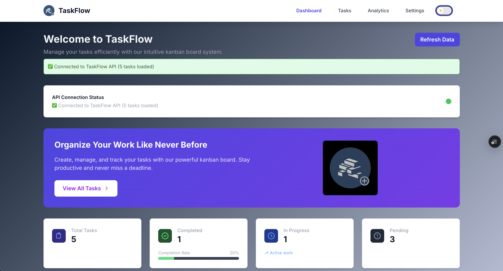
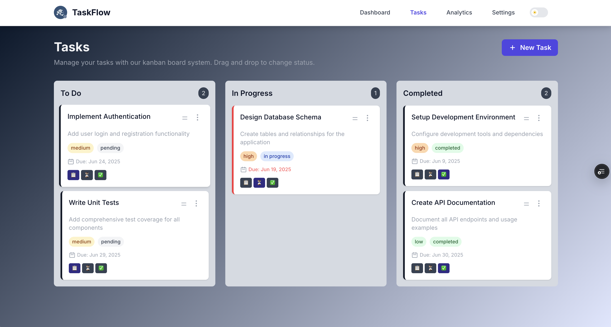
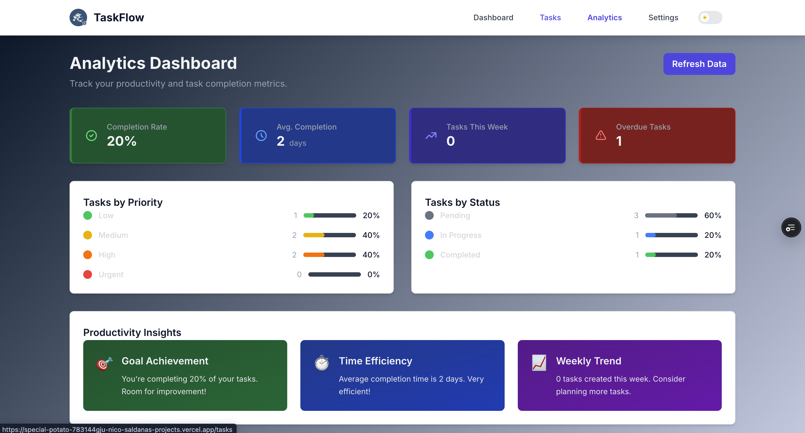
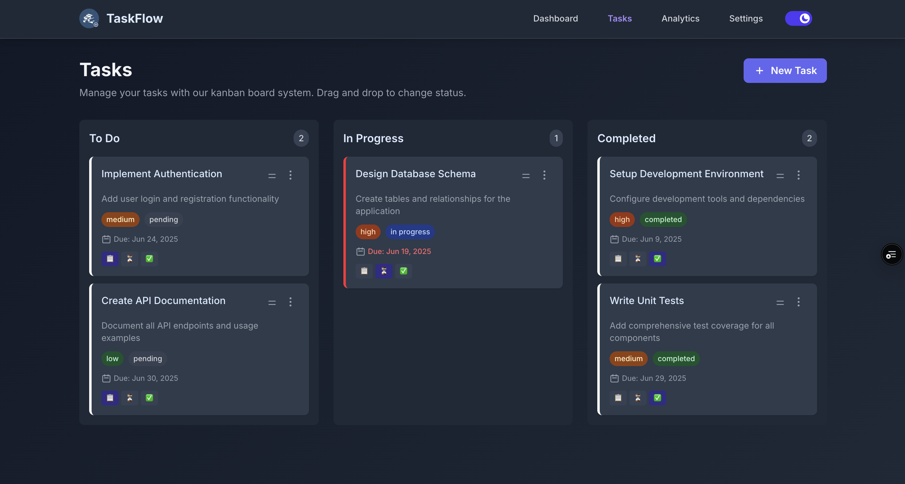

# TaskFlow - Advanced Task Management Application

A modern, responsive task management application built with Next.js 15, React 19, and TypeScript. TaskFlow provides an intuitive kanban board interface for organizing tasks, comprehensive analytics, and an dark/light theme system.



## 🚀 Live Demo

**Deployed on Vercel:** (https://special-potato-black.vercel.app/)

## ✨ Features

- **📋 Kanban Board**: Drag-and-drop task management with three status columns (To Do, In Progress, Completed)
- **📊 Analytics Dashboard**: Comprehensive productivity insights with completion rates, time tracking, and visual charts
- **🌙 Theme System**: Dark/light mode toggle with system preference detection
- **📱 Fully Responsive**: Mobile-first design that will function on all devices
- **⚡ Performance Optimized**: Built with Next.js 15 and React 19 for optimal loading speeds
- **🎨 Modern UI**: Clean interface using Tailwind CSS v4 with custom design system
- **🔍 Organization**: Organize tasks by priority, status, and due dates
- **📈 Data Visualization**: Statistics charts showing task distribution and progress trends

## 🛠 Technology Stack

### Core Framework
- **Next.js 15** - React framework with App Router
- **React 19** - Latest React with concurrent features
- **TypeScript** - Type-safe development
- **Tailwind CSS v4** - Utility-first styling with custom design tokens

### New NPM Packages Added
1. **Recharts** (`recharts`) - For creating charts in the analytics dashboard. Chosen for its declarative API and TypeScript support, making it easy for visualizing task completion rates and priority distributions.

2. **Lucide React** (`lucide-react`) - Modern icon library providing consistent, customizable SVG icons throughout the application. Selected for its lightweight bundle size and comprehensive icon set that matches our clean design aesthetic.

3. **Date-fns** (`date-fns`) - Utility library for date manipulation and formatting. Implemented for handling due dates, creation timestamps, and calculating time-based analytics like "tasks this week" and overdue detection.

### Development Tools
- **ESLint** - Code linting with Next.js configuration
- **Jest + Testing Library** - Unit and integration testing
- **Turbopack** - Fast development bundler

## 🎯 Design Decisions & Architecture

### Component Architecture
TaskFlow follows a modular component architecture with clear separation of concerns. The application is structured around three main areas: the dashboard (overview), tasks (kanban board), and analytics (insights). Each page uses custom hooks for state management, ensuring reusable logic across components.

### Theme System Implementation
The dark/light mode system uses React Context for state management combined with CSS custom properties and Tailwind's dark mode classes. The theme persists in localStorage and respects system preferences on first visit.

### Performance Optimizations
Loading states are implemented throughout the application using custom Loading components and Suspense boundaries. The kanban board uses optimistic updates for immediate feedback when moving tasks, with error handling that reverts changes if the API call fails. All images use Next.js Image optimization, and components are lazy-loaded where appropriate.

### Responsive Design Strategy
The mobile-first approach ensures great performance on all devices. The kanban board transforms from a three-column desktop layout to a stacked mobile layout using CSS Grid and Flexbox. Navigation collapses into a hamburger menu on smaller screens, and all interactive elements maintain proper touch targets (44px minimum).

## 🚀 Getting Started

### Prerequisites
- Node.js 18+ 
- npm

### Installation

1. Clone the repository:
```bash
git clone https://github.com/Nicodrive11/special-potato.git
cd taskflow
```

2. Install dependencies:
```bash
npm install
```

3. Start the development server:
```bash
npm run dev
```

4. Open (http://localhost:3000) in your browser

### Environment Setup
The application currently uses sample data for demonstration. To connect to a real API, update the `apiService` configuration in `src/utils/api.ts`.

## 📱 Screenshots

### Dashboard


### Kanban Board


### Analytics


### Dark Mode


## 🧪 Testing

Run the test suite:
```bash
npm test
```

Run tests with coverage:
```bash
npm run test:coverage
```

## 📦 Build & Deployment

### Local Build
```bash
npm run build
npm start
```

### Vercel Deployment
The application is configured for automatic deployment on Vercel:

1. Connect your GitHub repository to Vercel
2. Configure environment variables if needed
3. Deploy automatically on every push to main

## 🗂 Project Structure

```
src/
├── app/                    # Next.js App Router pages
│   ├── analytics/         # Analytics dashboard
│   ├── settings/          # User preferences
│   ├── tasks/             # Kanban board
│   └── globals.css        # Global styles & theme
├── components/            # Reusable UI components
├── contexts/              # React Context providers
├── hooks/                 # Custom React hooks
└── utils/                 # Utility functions & API
```

---

Built with ❤️ using Next.js and modern web technologies.